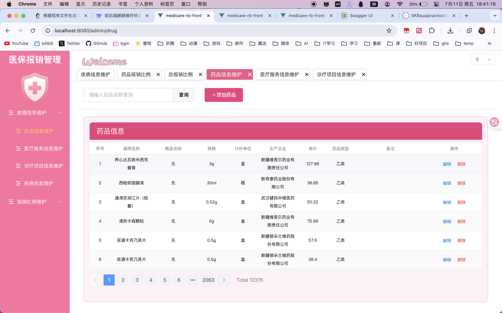
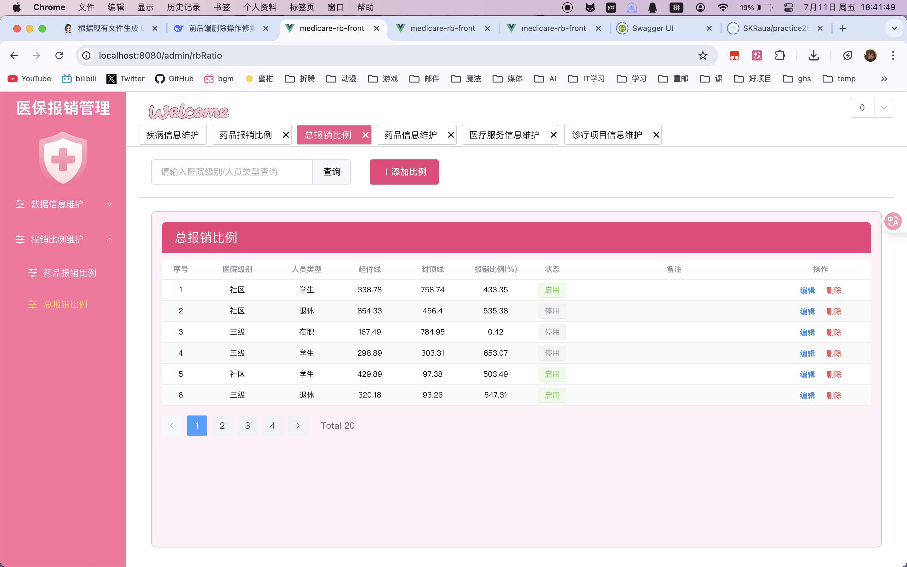
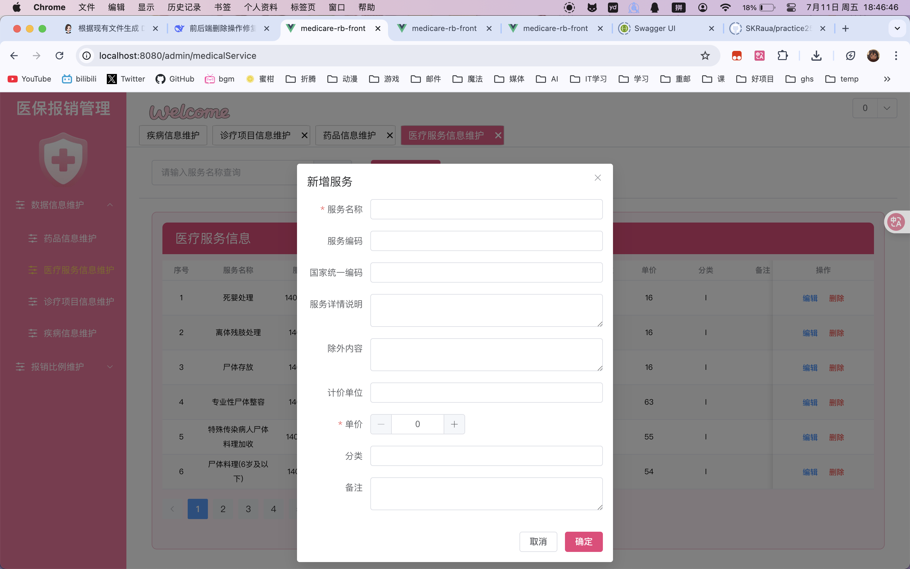
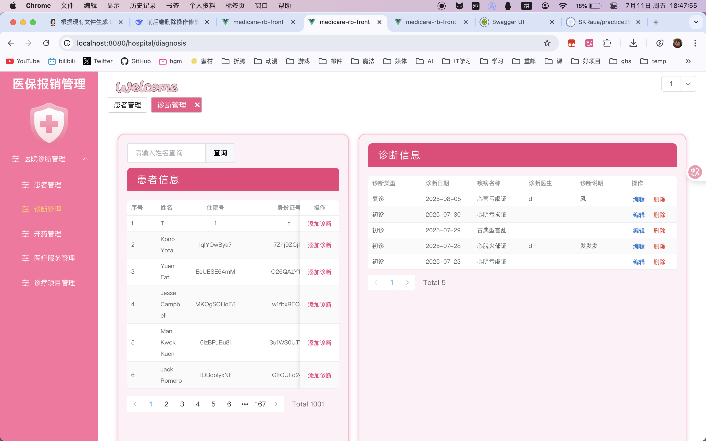
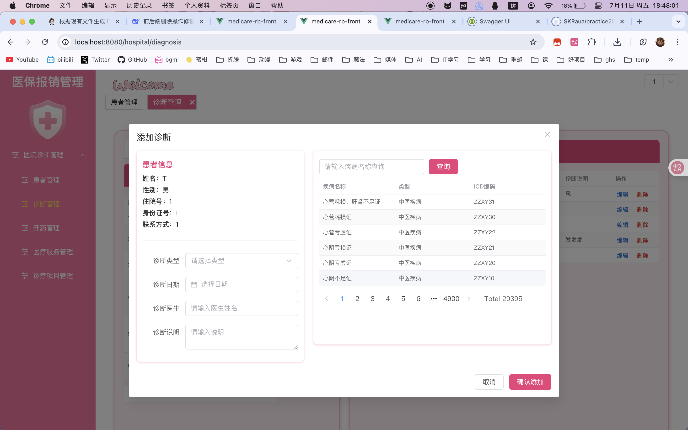
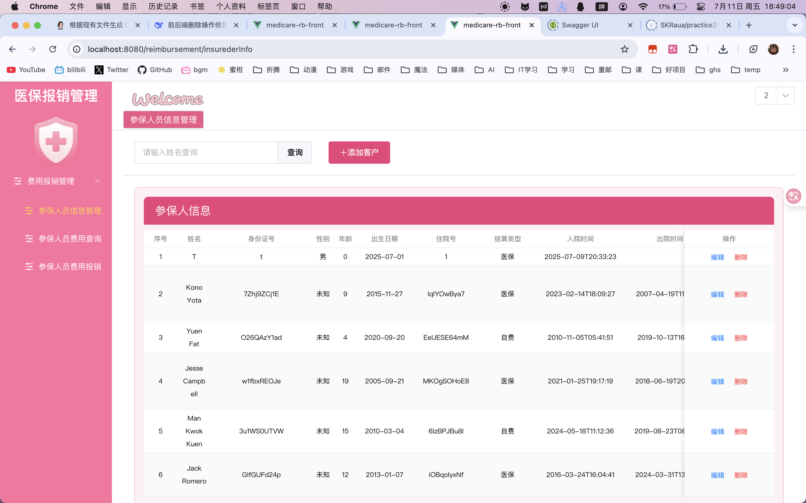
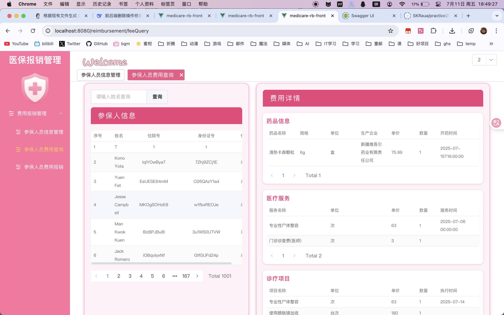
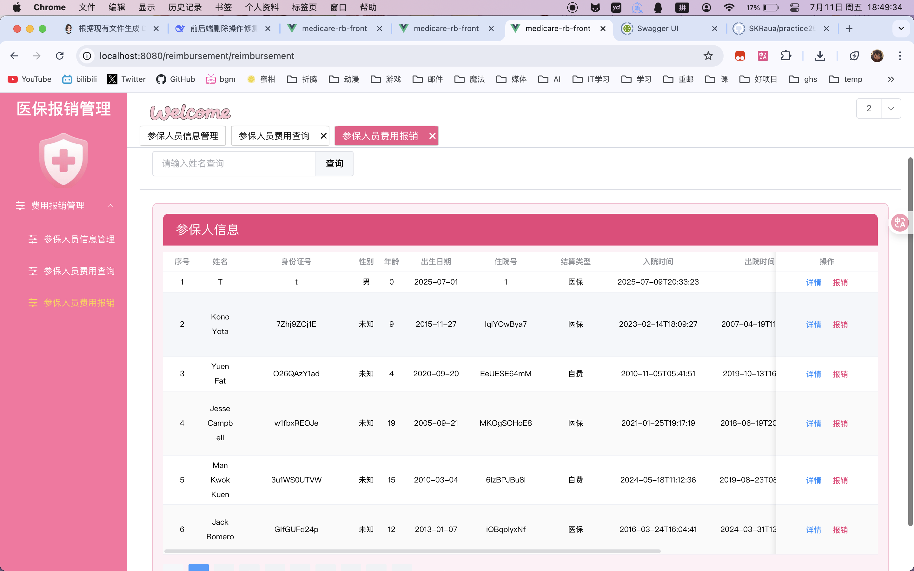
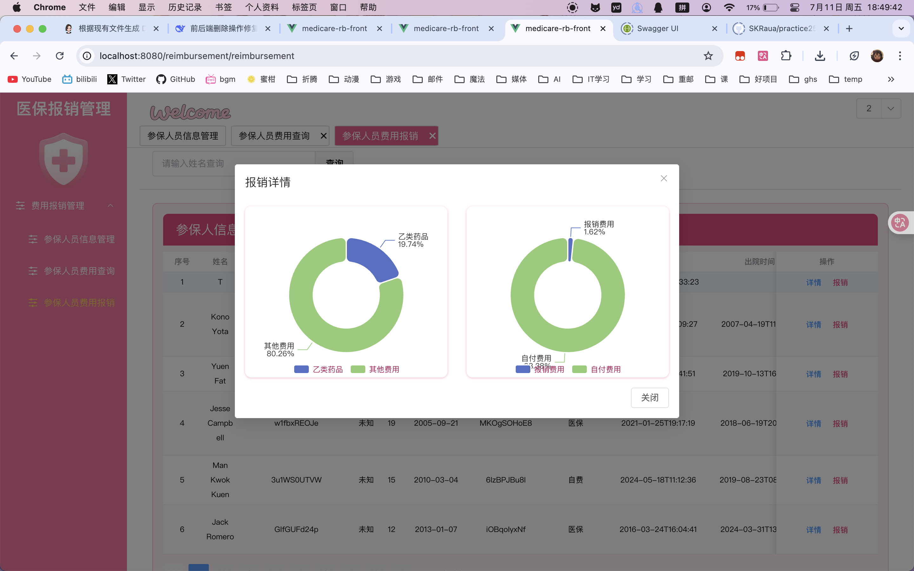
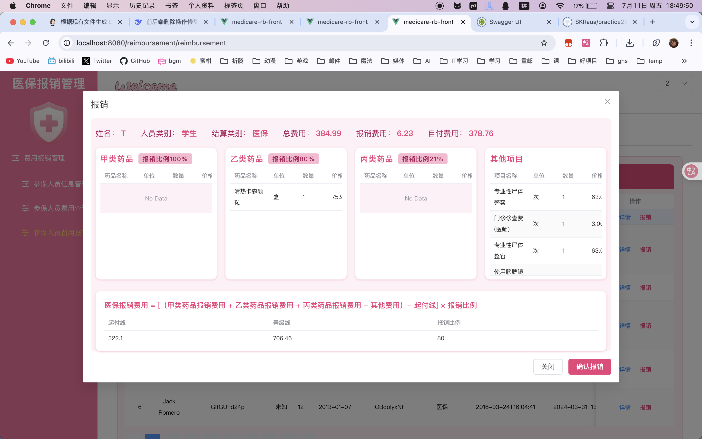

# 💊 医疗报销管理系统 💊

本项目为医疗报销管理系统，包含前端（[medicare-rb-front](vscode-file://vscode-app/Applications/Visual%20Studio%20Code.app/Contents/Resources/app/out/vs/code/electron-sandbox/workbench/workbench.html)）和后端（[medicare-rb-back](vscode-file://vscode-app/Applications/Visual%20Studio%20Code.app/Contents/Resources/app/out/vs/code/electron-sandbox/workbench/workbench.html)）两个子项目，支持药品信息维护、药品订单、医保报销比例、患者诊断等功能，适用于医院或医保相关场景。

## 目录结构

```
practice2506/
├── medicare-rb-front/   # 药品报销前端（Vue3）
├── medicare-rb-back/    # 药品报销后端（Spring Boot + MyBatis-Plus）
├── medicare_reimbursement.sql  # 数据库结构与初始化数据
├── ...
```

---

## 一、主要功能

### 1. 药品信息管理

- 药品的增删改查（通用名、商品名、规格、单位、生产企业、医保类型、单价、适应症等）
- 支持分页、模糊查询

### 2. 药品订单管理

- 患者开药、药品订单的增删改查
- 关联患者、医生、药品信息
- 支持分页、按患者/药品类型筛选

### 3. 报销比例管理

- 支持甲/乙/丙类药品的医保报销比例维护
- 报销比例的启用/禁用、历史记录

### 4. 报销计算与明细

- 根据患者、药品类型、报销比例自动计算医保报销金额、自付金额
- 支持费用明细、饼图等可视化展示

### 5. 诊断与疾病管理

- 支持患者诊断记录、疾病基础数据维护

---

## 二、技术栈

- **前端** ：Vue3 + Element Plus + Axios
- **后端** ：Spring Boot + MyBatis-Plus + Swagger
- **数据库** ：MySQL（推荐 8.0+，已提供建表及初始化数据脚本）

---

## 三、运行方式

### 1. 数据库准备

1. 安装 MySQL（推荐 8.0+）
2. 新建数据库 `medicare_reimbursement`
3. 执行根目录下的 [medicare_reimbursement.sql](vscode-file://vscode-app/Applications/Visual%20Studio%20Code.app/Contents/Resources/app/out/vs/code/electron-sandbox/workbench/workbench.html) 脚本，初始化表结构和基础数据

### 2. 后端启动（medicare-rb-back）

1. 进入后端目录

   ```
   cd medicare-rb-back
   ```

2. 配置数据库连接（`application.yml` 或 `application.properties`），确保与本地 MySQL 配置一致
3. 使用 IDE（如 IDEA）或命令行启动 Spring Boot 项目

   ```
   # Maven
   mvn spring-boot:run
   # 或
   mvn clean package
   java -jar target/medicare-rb-back-*.jar
   ```

4. 后端默认端口为 8888，接口文档可访问 `http://localhost:8888/swagger-ui.html`

### 3. 前端启动（medicare-rb-front）

1. 进入前端目录

   ```
   cdmedicare-rb-front
   ```

2. 安装依赖

   ```
   npm install
   ```

   其他依赖：Axios，Vuex（状态管理），Vue Router。。。
   （已包含在 node_modules 中）

   ```
   npm install echarts@^5.0.0 vue-echarts@6.7.2 element-plus @element-plus/icons-vue axios vuex@^4.0.0 vue-router@^4.0.0
   ```

3. 启动开发服务器

   ```
   npm run serve
   ```

4. 默认访问地址：`http://localhost:8080`（如有端口冲突可在 `vue.config.js` 修改）
5. 前端通过 axios 访问后端接口，已配置跨域

---

## 四、常用页面与功能入口

- **药品管理** ：`/admin/drug`（药品信息维护）
- **药品订单** ：`/hospital/drug`（患者开药、药品订单管理）
- **报销比例管理** ：`/admin/drugRbRatio`
- **费用报销** ：`/reimbursement/reimbursement`
- **诊断管理** ：`/hospital/diagnosis`

---

## 五、开发&部署建议

- 前后端分离，接口通过 `/api` 代理或直接跨域访问
- 推荐使用 IDEA + Vue3 插件开发
- 可根据实际业务扩展患者、医生、诊断等模块

---

## 六、项目关键页面演示

1. 数据维护模块

   

   

   

   

2. 医院模块

   

   

3. 报销管理

   

   

   

   

   

---

## 七、其他说明

- 代码结构清晰，注释完善，适合二次开发和学习
- 如遇到依赖或数据库问题，优先检查配置文件和端口

---

如需详细接口文档、二次开发指导，请参考各模块源码及注释。

---

**如有问题欢迎联系作者或提交 issue！**

---

文档由 AI 辅助完成

---

**祝你实训顺利！**
